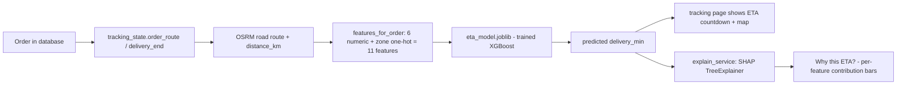

# FoodAI — Complete Codebase Report (Part 2)

> This is the second half of the report. Sections 1–3 (big-picture overview, folder & file structure, and concept explainers) live in `REPORT.md`; this file holds everything from §4 onwards. Read `REPORT.md` first, then continue here.

---

# 4. Code walkthrough

> The six most important files, walked through section by section. **Every snippet** below uses the same three-part structure: **What it does** (plain English) · **Why this way** (a realistic alternative, and why the chosen approach is better) · **What breaks if you did it the other way** (a small concrete failure). If a line is truly trivial, I'll say so explicitly instead of pretending there's a deep reason. One honest note: a few functions (like `simulation_loop` in `backend/simulation.py`) are described by name and behaviour rather than quoted line-by-line, because quoting demands I be exact — and where I'm not 100% sure of the text, I describe rather than guess.

## 4.1 `backend/main.py` — the backend's front door

The whole backend wakes up here. Roughly: import FastAPI → create the `app` object → run startup logic → hand over to uvicorn.

### Lifespan: what happens when the server starts

```python
# backend/main.py (abridged)
from contextlib import asynccontextmanager

@asynccontextmanager
async def lifespan(app: FastAPI):
    # Create tables + seed demo data on startup (Alembic migrations later).
    Base.metadata.create_all(bind=engine)
    db = SessionLocal()
    try:
        seed.seed_if_empty(db)
    finally:
        db.close()
    simulation.MAIN_LOOP = asyncio.get_running_loop()
    task = None
    try:
        task = asyncio.get_running_loop().create_task(simulation.simulation_loop())
    except Exception:
        logger.exception("simulation loop failed to start; continuing without it")
    yield
    if task is not None:
        task.cancel()
```

- **What it does —** This is the app's "setup and teardown" block. On startup it (1) creates any missing tables, (2) fills the database with demo data if it's empty, (3) tells the simulation where the running event loop is, and (4) starts the rider-simulation background task. `yield` is the magic word: everything above it runs at startup, everything below it runs at shutdown (here, cancelling the sim task).

- **Why this way —** FastAPI's **lifespan** is the officially blessed place for this, because it guarantees the setup runs *exactly once per server process*, before any request is served. A beginner might instead try putting `create_all` at the top of the file, outside any function. That can work in a script, but it runs even when you import the module just for testing, and it has no way to schedule cleanup.

- **What breaks if you did it the other way —** If you ran `create_all` at import time, then a test that merely imports `backend.main` would silently create/seed a real database — wiping your dev data or clashing with the test DB. Worse, you couldn't shut the background sim task down cleanly, so the process would hang on exit.

- *Why `yield`?* This is worth its own mini-note. A `@asynccontextmanager` is a function that "pauses" at `yield`: the code before runs first, then the caller gets to run, then the code after runs last. It's Python's way of saying "before/after" for anything that needs cleanup. A beginner alternative would be a pair of manual `start()` / `stop()` functions called from a `main()` — functional, but you'd have to remember to call both, and if an exception happens in between, `stop()` gets skipped.

- **What breaks otherwise —** If you forget the `finally: db.close()` *inside* the seed block, a DB connection leaks every restart. If you forget `task.cancel()`, the sim loop keeps running after shutdown and the process won't exit.

### Why `Base.metadata.create_all` and Alembic both exist

The code comment says "Alembic migrations later" — but the repo actually *has* Alembic migrations in `backend/alembic/`. The design: `create_all` creates tables for local dev convenience; Alembic migrations are the "grown-up" path used by Docker/CI/production. Both are idempotent (safe to run repeatedly). We'll revisit this trade-off in §6.

### CORS: who is allowed to knock on the door

```python
# backend/main.py (abridged)
from fastapi.middleware.cors import CORSMiddleware
app.add_middleware(
    CORSMiddleware,
    allow_origins=config.CORS_ORIGINS,
    allow_credentials=True,
    allow_methods=["*"],
    allow_headers=["*"],
)
```

- **What it does —** Tells the browser "it's OK for the page at `http://localhost:3000` to call this API at `http://localhost:8000`." Without this, browsers block the frontend's requests entirely (that's the **same-origin policy** — a browser privacy rule that stops website A from freely reading website B's data).

- **Why this way —** A beginner's first instinct is often `allow_origins=["*"]` (allow everyone). That works for pure APIs but *breaks* anything that sends credentials. Using the explicit `CORS_ORIGINS` list from config means local dev (3000/8501) works while still keeping the door closed to random websites.

- **What breaks if you did it the other way —** With `"*"` + credentials, browsers silently refuse to even send the request, and you get a confusing CORS error in the console with no clue why. With a hardcoded single origin, your colleague's `localhost:3000` (vs `127.0.0.1:3000`) mysteriously fails. The config list avoids both.

### What this file does *not* contain (important!)

`main.py` has **no business logic**. No SQL, no promo math, no models. That's deliberate: the routers live in `backend/routers/`, and `main.py` only imports and registers them.

```python
# backend/main.py (abridged)
from backend.routers import admin, auth, ml, orders, restaurants, reviews, tracking

app = FastAPI(title="FoodAI API", version="0.1.0", description="...")
app.include_router(auth.router)
app.include_router(restaurants.router)
app.include_router(orders.router)
app.include_router(tracking.router)
app.include_router(tracking.ws_router)
app.include_router(ml.router)
app.include_router(admin.router)
app.include_router(reviews.router)
```

- **What it does —** Makes FastAPI aware of every route group. Each router file builds a `router = APIRouter(prefix="/x")`; `include_router` hangs them on the app.

- **Why this way —** Separating routers by concern means `orders.py` only deals with orders. A beginner might put all 30 endpoints in `main.py` for "simplicity" — a classic trap that becomes a 3,000-line unreadable file by week 3.

- **What breaks otherwise —** With everything in one file, a single import error anywhere blocks the *entire* app from starting, and two people editing the same file constantly collide. With routers, `admin.py` can have a syntax error and the rest of the API still boots.

> `import backend.models  # noqa: F401` — this is a standard "import for its side effects" line: importing the models module registers all the table classes on `Base.metadata` so `create_all` knows about them. The `noqa: F401` tells linters "yes, I know I'm not using this name, stop complaining." No alternative worth discussing — it's the standard SQLAlchemy pattern.

## 4.2 `backend/db.py` — the database plumbing

```python
# backend/db.py
from sqlalchemy import create_engine
from sqlalchemy.orm import declarative_base, sessionmaker

from backend import config

engine = create_engine(config.DATABASE_URL, pool_pre_ping=True)
SessionLocal = sessionmaker(bind=engine, autocommit=False, autoflush=False)

Base = declarative_base()


def get_db():
    """FastAPI dependency: yield a session and always close it."""
    db = SessionLocal()
    try:
        yield db
    finally:
        db.close()
```

This entire file is 29 lines, and that's a feature: it contains *only* plumbing.

- **What `create_engine` does —** Creates the connection pool: a small set of always-ready DB connections that requests borrow and return. `pool_pre_ping=True` checks a connection is still alive before handing it out.
- **What `SessionLocal` is —** A factory (an object that makes other objects). Every request needs its own short-lived "session" — a conversation with the DB — and `sessionmaker` builds those.
- **What `declarative_base()` does —** Returns the ancestor class that all the models in `models.py` will inherit from, so SQLAlchemy knows where to register tables.
- **What `get_db` is —** A **FastAPI dependency**: a generator FastAPI calls per request, then passes the result into your route function as the `db` parameter. The `finally` guarantees the session is always closed, even if the handler crashes.

- **Why this way —** The cleanest alternative a beginner reaches for is a single global connection used everywhere. That seems simpler — but DB connections break (timeouts, network blips), and if a connection dies, *every* request suddenly fails. Per-request sessions with a pool mean one bad session can be discarded without taking down the app.

- **Why `yield` + `finally` instead of just returning the session?** Because the route function needs the session to be open *while it runs*, then closed *after*. A generator's `yield` is the cleanest expression of that lifecycle. The alternative — returning a session and closing it in each route — means repeating `db.close()` in 30+ places, and the first one you forget becomes a leaked connection that eventually exhausts the pool.

- **What breaks if you did it the other way —** The classic global-connection bug: the DB restarts, your pool still hands out the dead connection, and the whole API 500s until the process restarts. With `pool_pre_ping` + per-request sessions, the app heals itself on the next request.

- *`autocommit=False, autoflush=False`* — this is a standard SQLAlchemy idiom, not a FoodAI choice: it makes the session apply changes only when you explicitly `commit()`, giving you control over transactions. No alternative worth discussing — it's the framework's recommended default.

## 4.3 `backend/models.py` — the database schema as Python classes

```python
# backend/models.py (abridged)
from sqlalchemy import Column, Integer, String, Float, Boolean, DateTime, ForeignKey, Text
from sqlalchemy.orm import relationship

VALID_ROLES = ("customer", "restaurant", "delivery", "admin")
VALID_ORDER_STATUSES = (
    "PLACED", "CONFIRMED", "PREPARING", "OUT_FOR_DELIVERY", "DELIVERED", "CANCELLED",
)


class User(Base):
    __tablename__ = "users"

    id = Column(Integer, primary_key=True)
    name = Column(String(255), nullable=False)
    email = Column(String(255), nullable=False, unique=True)
    password_hash = Column(String(255), nullable=False)
    role = Column(String(32), nullable=False)

    restaurants = relationship("Restaurant", back_populates="owner")
    deliveries = relationship("Delivery", back_populates="driver")
```

- **What it does —** Turns SQL tables into Python classes. Each class = a table; each `Column` = a column. The `VALID_*` tuples are the allowed values, shared app-wide so a typo can't create an invalid role or status.

- **Why this way (class per table) —** A beginner might write raw SQL strings (`CREATE TABLE users (...)`), like the legacy `database.py` does. SQLAlchemy's **ORM** (Object-Relational Mapping) lets you write `db.add(user)` and `db.query(User)` — the DB stays a detail. The huge win: `relationship("Restaurant", ...)` lets you do `restaurant.owner.name` and SQLAlchemy writes the JOIN for you; with raw SQL you'd maintain that query by hand.

- **What breaks if you did it the other way —** Raw-SQL schema means: no type checking, every query re-written by hand, and one wrong column name in one string fails only at runtime (often in production). The ORM catches column typos at the *first* query with a clean Python error.

- **Why `email` is `unique=True` —** Nobody should share an email. The database enforces it with a unique index, *in addition to* the API's pre-check in `auth.py`.

- **What breaks otherwise —** If only the API checked, two simultaneous registrations with the same email could both pass the check and both insert — the classic race condition. The DB constraint is the backstop that makes it impossible.

- **Why passwords store a `password_hash`, never the password —** If the database leaks, the attackers get useless scrambled text, not "password123". §3 of the README (and `security.py`) explain the hashing.

- **What breaks otherwise —** A leaked plaintext DB is a headline. Even a ".env" file with one shared password is a headline.

Other tables follow the same pattern: `Order.id/customer_id/restaurant_id/delivery_id/status/total/coupon_code/discount_amount/delivery_lat/delivery_lng/delivery_address/created_at`; `OrderItem` (line items linking `order_id` and `menu_item_id`); `Delivery` (the rider assignment with `pickup_time`/`delivered_time`); `TripLog` (position history); `PromoCode`; `Review`; `MenuItem`; `Restaurant`. Collectively they're the full schema of §3.3.

## 4.4 `backend/routers/orders.py` — the order flow

This router has the most business logic. Let's walk its key ideas.

### Guarding the routes by role

```python
# backend/routers/orders.py
customer_only = security.require_roles("customer")
restaurant_or_admin = security.require_roles("restaurant", "admin")
restaurant_admin_or_delivery = security.require_roles("restaurant", "admin", "delivery")
```

- **What it does —** Pre-builds three reusable access checks. Then each route takes `user: User = Depends(customer_only)` and FastAPI refuses the call unless the logged-in user has that role.

- **Why this way —** `require_roles` returns a *dependency* — a reusable function FastAPI calls automatically. A beginner might hand-write `if user.role != "customer": raise HTTPException(403)` in every customer endpoint — but this is very repetitive and easy to get wrong per endpoint.

- **What breaks otherwise —** If some endpoint forgets its role check, a customer could cancel other people's orders. Centralizing means the guard is *attached by the parameter type* — you'd have to deliberately omit it to bypass it.

### The promo-code logic

```python
# backend/routers/orders.py (promo helpers, abridged)
def _promo_payload(promo: PromoCode) -> dict:
    return {
        "id": promo.id,
        "code": promo.code,
        "description": promo.description,
        "discount_type": promo.discount_type,
        "discount_value": promo.discount_value,
        "min_order_value": promo.min_order_value,
        ...
    }
```

- **What it does —** Converts a database `PromoCode` row into the JSON shape the frontend expects. This is a "serializer" — a data-shaping helper.

- **Why this way —** A beginner might return the ORM object directly. That leaks fields (like `times_used` or `usage_limit`) that should stay internal, and binds the API's output to the database's exact column names. An explicit payload function controls exactly what the API exposes.

- **What breaks otherwise —** Returning the raw object exposes internal fields in the API response, and if a column is renamed in the DB, the API's output silently changes — breaking the frontend for reasons that are hard to debug.

How order creation actually works (this is the heart of §1.3's step 6): the `POST /orders` handler (and `POST /orders/batch` for multi-restaurant carts) does, roughly, for each restaurant in the request:

1. Load the restaurant and confirm it exists.
2. For each requested item, load the `MenuItem` **from the database** and use its server-side `price` and `prep_time_min` — never the values the browser sent.
3. Sum the line totals → subtotal.
4. If a `coupon_code` was supplied, call the promo validation (supported? not expired? minimum met? usage limit not exhausted?) and compute `discount_amount` from the `discount_type` (`percent` vs `fixed`).
5. Build an `Order` row (status `PLACED`), add `OrderItem` rows, increment the promo's `times_used`, `commit()` everything in one transaction. A `publish_sync` call pushes a "new order" notification to the restaurant's channel.
6. Return the order JSON.

The key principle is **"the client never sets prices"** — a ten-line `if` in one place that stops an entire class of security bugs (see §6, Decision #3).

## 4.5 `eta_service.py` — the AI's front door

This is the cleanest example of the whole ML story, so it gets the most detailed walkthrough.

```python
# eta_service.py
NUMERIC_COLUMNS = [
    "distance_km",
    "prep_time_min",
    "hour_of_day",
    "day_of_week",
    "is_weekend",
    "traffic_factor",
]
ZONES = ["zone_A", "zone_B", "zone_C", "zone_D", "zone_E"]
FULL_COLUMNS = NUMERIC_COLUMNS + ZONES  # 11 features
```

- **What it does —** The 11 feature names the ETA model was trained on, in order: 6 numbers + 5 one-hot zone columns (see §3.9 for one-hot). `FULL_COLUMNS` is the contract between training and prediction.

- **Why this way —** The model is just a math function: it takes an array of exactly 11 numbers and returns one number. If the order of those numbers changed between training and prediction, the output would be silently garbage. By listing the columns explicitly, you make the contract visible and reviewable.

- **What breaks otherwise —** Suppose training used `[hour, distance, zone_A..E]` but prediction built `[distance, hour, zone_A..E]`. The model would treat the distance value as the hour value — predictions would be nonsense, and nobody would know why, because the code would *run fine*. This "silent misalignment" is the classic ML production bug.

```python
# eta_service.py
@lru_cache(maxsize=1)
def load_model():
    """Load the persisted XGBoost model, cached by lru_cache."""
    if joblib is None:
        print("ETA model disabled: joblib not installed; using fallback ETA.")
        return None
    if not MODEL_PATH.exists():
        print("ETA model not found; using fallback computed ETA.")
        return None
    return joblib.load(MODEL_PATH)
```

- **What it does —** Loads the trained model file once. `lru_cache(maxsize=1)` means Python remembers the result after the first call and returns it instantly forever after — because loading a model from disk is slow and we never want to do it per-request.

- **Why this way —** The alternative (loading the model inside every request) is easy to write but expensive: XGBoost files can be tens of MB. Caching at module level also means "file missing → return None" is remembered, so the fallback warning prints once, not 10,000 times.

- **What breaks if you did it the other way —** Without caching, the first ETA request after each server start would be noticeably slow, and if the file were missing, the console would spam the warning with every prediction. Neither is fatal — but both are exactly the kind of thing that makes a demo look bad.

```python
# eta_service.py (functions abridged)
def predict_eta(dist_km, prep_min, hour, day, weekend, traffic) -> float:
    """Predict delivery minutes from raw inputs; fallback to formula."""
    model = load_model()
    if model is None:
        return tracking.compute_eta(dist_km, prep_min)
    features = np.array([[...6 numbers...] + [0.0] * 5])
    return float(model.predict(features)[0])
```

- **What it does —** The whole ML flow in four lines: get the model (or not), if missing use a simple formula, otherwise build the 11-number vector and ask the model for the predicted minutes.

- **Why this way —** The **graceful fallback** is the design decision that makes this whole app demo-proof: if the model file is absent (fresh clone, CI, no XGBoost installed), the app still shows an ETA — just from a formula instead of the AI. No crash, no 500.

- **What breaks otherwise —** If the code instead raised `FileNotFoundError`, every tracking page would error on machines without the model — a beginner would then catch the error in 20 places, and each catch is another chance to forget one. The `return None` + fallback pattern keeps the failure contained in one function.

- *The `np.array` line* — this converts the Python list into a numpy array, the format XGBoost requires. The `[0.0] * 5` is a shortcut for a 5-zero list (the one-hot block for an unknown/None zone → all zones "off"). No real alternative worth discussing — both numpy and the [0.0]*5 idiom are standard.

```python
# eta_service.py
def features_for_order(distance_km, prep_time_min, hour, day_of_week, weekend, traffic, zone) -> list:
    """Build the 11-feature vector the model expects: 6 numeric + 5 one-hot zone."""
    one_hot = [1.0 if z == zone else 0.0 for z in ZONES]
    return [distance_km, prep_time_min, hour, day_of_week, weekend, traffic] + one_hot
```

- **What it does —** Converts "human" order data into the model's input: the 5-zone one-hot plus the 6 numbers.

- **Why this way —** One-hot encoding is the representation the model learned from. Using a small, explicit function means every caller (REST ETA, SHAP explainer, tracking) builds the vector identically.

- **What breaks otherwise —** If each caller built its own vector, one caller might forget the one-hot step or order it wrong → that one endpoint produces silently bad predictions.

```python
# eta_service.py (abridged)
def best_eta(order, db):
    """Compute the best ETA for an order: ML if model available, else formula."""
    features = features_for_order(
        distance_km=order.distance_km,
        prep_time_min=order.prep_time_min,
        hour=order.hour,
        day_of_week=order.day_of_week,
        weekend=order.is_weekend,
        traffic=order.traffic_factor,
        zone=order.customer_zone,
    )
    model = load_model()
    if model is None:
        return tracking.compute_eta(order.distance_km, order.prep_time_min)
    return float(model.predict([features])[0])
```

- **What it does —** The highest-level ETA function: takes a real `Order` object, pulls out its features, and returns the best ETA we can produce.

- **Why this way —** It's a **facade**: callers (tracking page, ML router) don't care whether it's ML or formula — they just call `best_eta(order, db)`. The fallback logic lives here, not in 5 places.

- **What breaks otherwise —** If the fallback lived in each caller, the tracking page might use the ML path while the admin dashboard accidentally uses the formula, producing inconsistent ETAs that confuse users.

> **The one thing to double-check before an interview/viva**: why does the one-hot zone block use `[0.0] * 5` in `predict_eta` but real zone details in `features_for_order`/`best_eta`? Because `predict_eta` is the "quick" path when you have no zone (it just says "no zone info → all zones off"); the higher-level functions have the real zone. Both produce identical shapes — 11 numbers — which is what keeps the model happy.

## 4.6 `backend/simulation.py` + `backend/routers/tracking.py` — live tracking

### The pub/sub broker

```python
# backend/simulation.py (abridged)
class ConnectionManager:
    """In-process pub/sub for order tracking channels (order_id -> sockets)."""

    def __init__(self) -> None:
        self._channels: Dict[int, Set] = defaultdict(set)
        self._lock = asyncio.Lock()

    async def subscribe(self, order_id: int, websocket) -> None:
        async with self._lock:
            self._channels[order_id].add(websocket)

    async def unsubscribe(self, order_id: int, websocket) -> None:
        async with self._lock:
            self._channels[order_id].discard(websocket)
            if not self._channels[order_id]:
                self._channels.pop(order_id, None)
```

- **What it does —** A dictionary mapping `order_id` → set of connected browser sockets. `subscribe` joins a channel; `unsubscribe` leaves it (and removes the channel when empty). `publish` sends a message to every socket in a channel.

- **Why this way —** `defaultdict(set)` means "reading any key creates an empty set if absent" — so `subscribe` never needs an `if order_id not in self._channels` guard. The `asyncio.Lock` protects the dict because multiple concurrent websocket handlers could mutate it at almost the same time (think: 2 browsers joining the same order simultaneously).

- **What breaks otherwise —** Without the lock, two simultaneous subscribers could interleave their operations and one could be lost from the set — a user would just never receive updates, with no error message. (This is the "thread-safety for async" version of the race condition from §4.3.)

### Who is allowed to watch an order?

```python
# backend/routers/tracking.py
def _can_access_order(user: User, order: Order, db: Session) -> bool:
    if user.role == "admin":
        return True
    if user.role == "customer":
        return order.customer_id == user.id
    if user.role == "restaurant":
        return any(r.id == order.restaurant_id for r in user.restaurants)
    if user.role == "delivery":
        return (
            db.query(Delivery)
            .filter(Delivery.order_id == order.id, Delivery.driver_id == user.id)
            .first()
            is not None
        )
    return False
```

- **What it does —** The access rule for live tracking: admins always; customers only their own order; restaurants only their own restaurant's orders; riders only *assigned* to that order. Everything else is denied.

- **Why this way —** One function, used by both the REST endpoint and the WebSocket. The rider check needs a DB query because "is this rider assigned?" can't be answered from the user object alone.

- **What breaks if you did it the other way —** If each role's check were duplicated inline in both endpoints, a fix to the restaurant rule would likely be applied in one place only — leaving the other endpoint wide open (or wrongly locked).

### How the simulation actually advances the riders

`SIM_INTERVAL_SECONDS = 2.0` is the heartbeat. A background `simulation_loop()` runs forever: every 2 seconds it (1) opens a DB session, (2) finds every active delivery (picked up, not yet delivered), (3) for each, asks `rider_progress` (from `tracking_state.py`) how far along the route the rider should be *given the wall-clock elapsed time*, (4) logs a `TripLog` position row, and (5) `publish`s the position over the order's WebSocket channel. When progress hits 100%, it flips the order to `DELIVERED`, stamps `delivered_time`, and publishes a "delivered" event.

- **Why time-based, not step-based, movement?** The sim moves riders by *elapsed real time* against the *predicted total trip time* (from the ML ETA): if the trip is predicted 20 minutes, then at minute 10 the rider is at 50% of the route. This keeps the map visibly consistent with the ETA countdown. The alternative — advancing a fixed distance per tick — would either finish too early or never visibly move for long routes.

- **What breaks otherwise —** If riders moved by fixed steps, a 2-km order and a 12-km order would cross the map at the same speed; the ETA countdown and the map pin would constantly contradict each other, and the "live" illusion would die.

### The WebSocket endpoint

The `ws_router` handles `/ws/tracking/{order_id}`. The flow: accept the socket → read the JWT from the `token` query parameter (note: **browsers can't set headers on a WebSocket upgrade, so the token rides in the URL** — a classic gotcha worth remembering) → run `_can_access_order` → build one tracking snapshot and send it → subscribe to the channel → loop receiving (mostly ignored) client pings and sending updates until disconnect → unsubscribe.

- **Why the token in the URL?** Because WebSocket connections in browsers simply don't support custom headers. The alternative — no auth at all, just "anyone who knows the order id can watch" — is how data leaks happen.

- **What breaks otherwise —** Without auth, any user could open `/ws/tracking/3` and watch everyone's live locations indefinitely.

## 4.7 The frontend's tracking page — where it all comes together

```tsx
// frontend/src/app/tracking/[orderId]/page.tsx (abridged)
const FEATURE_LABELS: Record<string, string> = {
  distance_km: "Distance",
  prep_time_min: "Prep time",
  hour_of_day: "Time of day",
  day_of_week: "Day of week",
  is_weekend: "Weekend",
  traffic_factor: "Traffic",
  zone_A: "Zone A",
  zone_B: "Zone B",
  zone_C: "Zone C",
  zone_D: "Zone D",
  zone_E: "Zone E",
};

const applyState = useCallback((s: TrackingState) => {
  setState((prev) => ({
    ...s,
    route: s.route?.length ? s.route : prev?.route ?? [],
  }));
}, []);
```

- **What it does —** `FEATURE_LABELS` turns the ML's cryptic feature names into words a human sees on the "Why this ETA?" panel. `applyState` merges an incoming tracking update while *preserving the route* if the new update didn't include one (the WebSocket position updates are small and don't carry the full polyline every time).

- **Why this way —** `applyState` is built with `useCallback` (React memoization so the function identity is stable) and a functional `setState((prev) => ...)`, which is React's safe way to update state based on the previous value. The alternative — `setState(s)` overwriting wholesale — would briefly blank the map route whenever a mini-update arrived without a route.

- **What breaks otherwise —** Without the "keep the best route" merge, the map's route line would flicker/erase every 2 seconds during live updates — a genuinely bad demo moment.

The page then: fetches an initial snapshot via REST ⇒ opens the WebSocket ⇒ on every `position` message updates the map + ETA; on `delivered`, shows the celebration state. The ETA number itself comes from `GET /ml/order/{id}`, and clicking **"Why this ETA?"** calls `POST /ml/eta/explain` and renders the SHAP bars with the `FEATURE_LABELS` names.

---

# 5. Data flow diagrams

## 5.1 Order placement flow

```mermaid
flowchart LR
    A[Customer clicks "Place order" on checkout page] --> B[Next.js frontend bundles cart + address + promo]
    B --> C[api.ts sends POST /orders/batch with JWT]
    C --> D[FastAPI orders router]
    D --> E[checks: logged in? items on menu? promo valid?]
    E --> F[SQLAlchemy creates Order + OrderItem rows]
    F --> G[PostgreSQL commit - order now permanent]
    G --> H[response JSON: order id, total, status PLACED]
    H --> I[frontend redirects to /tracking/orderId]
    I --> J[tracking page opens WebSocket + calls /ml/order/id]
    J --> K[live map + AI ETA + working demo]
```

## 5.2 ML prediction flow



## 5.3 Sequence diagram (a real order, start to finish)

```mermaid
sequenceDiagram
    participant C as Customer (browser)
    participant F as Next.js frontend
    participant B as FastAPI backend
    participant DB as PostgreSQL
    participant R as Rider simulation loop
    participant M as XGBoost ETA model

    C->>F: clicks Place order on checkout
    F->>B: POST /orders/batch (JWT + cart + address + promo)
    B->>DB: validate user, menu items, promo
    B->>DB: INSERT orders + order_items; commit
    DB-->>B: order id 42, status PLACED
    B-->>F: 201 Created {orders:[...]}
    F->>C: redirect to /tracking/42
    F->>B: GET /ml/order/42
    B->>M: 11-feature prediction
    M-->>B: 28.4 minutes
    B-->>F: {eta_min: 28.4, features: [...]}
    F->>B: WS open /ws/tracking/42?token=...
    loop every 2 seconds
        R->>B: advance rider along route (elapsed/ETA)
        B->>DB: insert trip_logs row
        B-->>F: WS {type: position, lat, lng, progress}
        F-->>C: move map pin, update countdown
    end
    R->>B: progress = 100%
    B->>DB: order.status = DELIVERED
    B-->>F: WS {type: delivered}
    F-->>C: show "Delivered!" + prompt to review
```

## 5.4 The legacy (Streamlit) data flow, for comparison

Old app flow: `st_autorefresh` reruns the whole `app.py` script every 2.5 s → each rerun calls `database.get_latest_trip_position` → draws a folium map. That's **polling** (ask-answer-ask), versus the new app's **push** (WebSocket). Both accomplish "live map", but the new way is real-time and efficient.

---

# 6. "Why this design decision" callouts

These are the five (plus a few bonus) trade-offs a junior dev should be able to talk about, because they each represent a conscious choice.

## Decision 1: SQLite → MySQL → PostgreSQL

- **What happened:** The very first prototype used a single SQLite file (`foodai.db` — still sitting in the repo as a fossil). The legacy Streamlit app moved to MySQL. The new backend uses PostgreSQL.
- **Why:** SQLite is a library, not a server — perfect for learning, but it handles one writer at a time, which would break the "two people order at once" case (Q&A #2). MySQL was a reasonable mid-step (free, common). PostgreSQL was chosen for the final stack because it's the most robust free option — better concurrency, better JSON support, and it's what Render (the deployment target in `render.yaml`) provisions natively.
- **The trade-off:** Postgres is heavier to run locally (a separate server process). Docker (`docker-compose.yml`) hides that pain.

## Decision 2: XGBoost over linear regression / deep learning

- **What:** Four models were trained and compared (`scripts/train_eta.py`): a hand-written formula baseline, `LinearRegression`, `RandomForestRegressor`, and `XGBRegressor`. The saved metrics (`outputs/metrics_eta.json`) are: baseline MAE 2.84 / RMSE 3.63; linear MAE 1.93 / RMSE 2.47; random forest MAE 1.65 / RMSE 2.00; XGBoost MAE 2.03 / RMSE 2.61. Interesting and honest detail: on this small dataset the random forest edged out XGBoost slightly, but **XGBoost is the one persisted as `eta_model.joblib`** — it's the README's documented champion, the one the SHAP explainer was built around, and the one a viva answer should reference (all tree ensembles beat the baseline and linear model comfortably).
- **Why XGBoost is the "right" poster child even when a forest ties it:** on tiny datasets like this one, tree ensembles are the strongest default; XGBoost is the best-known, best-documented tree library; and it's the one the README and the SHAP explainer are built around. Linear regression is simpler to explain but couldn't capture "distance × traffic" interactions without hand-built feature engineering. Deep learning would be overkill and data-hungry for 600 rows.
- **The trade-off:** XGBoost is less "explainable" than linear regression — which is *exactly why* the SHAP layer exists (see Decision 4).

## Decision 3: The client never sends prices

- **What:** When an order is created, the backend ignores any price the browser sent and re-reads each item's price from `menu_items` in the database.
- **Why:** If the frontend sent prices, anyone could open DevTools, change a price to ₹0, and "buy" anything for free.
- **The trade-off:** Slightly more database work per order, and the frontend's displayed total might differ from the server's total (the server's wins). Zero security trade-off — this is simply the correct design.

## Decision 4: Polling in the legacy app → WebSocket in the new app

- **What:** Old app: `st_autorefresh(interval=2500)` reruns the page every 2.5 s. New app: a persistent WebSocket where the backend pushes updates every 2 s.
- **Why:** Polling re-runs the *entire* Streamlit script each time — wasteful, and capped at the refresh interval. WebSockets give true instant updates with far less traffic; and the backend can *notify* (rider assigned! order cancelled!) instead of waiting for the client to ask.
- **The trade-off:** WebSockets are more complex — connection lifecycle, auth-in-URL, reconnection logic. For a *student project*, polling was "good enough" and simpler; the re-platform was the moment to pay the complexity cost for the product feel.

## Decision 5: In-memory pub/sub, not Redis

- **What:** `ConnectionManager` keeps `{order_id: set_of_sockets}` in the server's memory.
- **Why:** It's drastically simpler and works for a single-process demo. The code is structured (publish/subscribe methods) so that swapping to Redis later only means replacing the internals of `publish`/`subscribe`.
- **The trade-off:** If you ran *two* backend processes (load balancing), the two memory stores would be separate and riders would only be broadcast from one. For a demo, single-process is fine; for production you'd need Redis (a shared message broker).

## Decision 6: SQLAlchemy ORM over raw SQL

- **What:** The legacy `database.py` writes raw SQL strings; the new backend uses SQLAlchemy models and queries.
- **Why:** Safety (no SQL-injection string concatenation), type-friendly code, relationships as Python attributes, and it abstracts away MySQL vs PostgreSQL differences.
- **The trade-off:** A layer of magic — beginners must learn what `session.commit()` does. But the legacy code proves the cost of the alternative: 700+ lines of hand-written SQL.

## Decision 7: Graceful ML degradation everywhere

- **What:** Every ML endpoint and service checks "is the model file there?" and falls back (formula ETA, moving-average forecast, `"fallback": true` flag in the JSON) instead of raising.
- **Why:** The app must demo even on a machine that hasn't run the training scripts yet.
- **The trade-off:** A silent return to a worse prediction if the model file is *accidentally* deleted — mitigated by the `"fallback": true` flag, which the frontend could show as "estimated".

## Decision 8: One-hot zones + explicit feature columns

- **What:** Zones are encoded as 5 zero/one columns; feature order is documented in `FULL_COLUMNS` / `forecast_meta.json` and mirrored identically in training and inference.
- **Why:** Trees can't compare a "zone A" string meaningfully; and silent column-order drift is the #1 ML bug, so it's made impossible.
- **The trade-off:** Each zone becomes 5 numbers (slightly wider vectors) — trivial cost, huge reliability win.

---

# 7. Glossary

Alphabetical, one-line definitions, every technical term used in this report.

- **API (Application Programming Interface)** — the agreed rulebook for how two programs talk; the waiter between the frontend and the backend. (§3.1)
- **Alembic** — a tool that manages database schema changes as versioned "migrations". (§2.2)
- **autoflush/autocommit** — SQLAlchemy session flags; `autoflush=False` means the session doesn't send queries until you commit. (§4.2)
- **backend** — the server-side program that validates and stores data; here, the FastAPI app in `backend/`. (§1.2)
- **channel** — in pub/sub, a named topic (here: an `order_id`) that subscribers listen to. (§4.6)
- **CI (continuous integration)** — automating tests to run on every code push, so broken changes are caught immediately. (§2.6)
- **commit** — making your database changes permanent and visible to others. (§4.4)
- **concurrency / race condition** — when two operations happen at nearly the same time and interfere; a race is when the outcome depends on which wins the race. (§4.3)
- **connection pool** — a maintained set of always-ready database connections that requests borrow and return. (§4.2)
- **context (React)** — a way to share state across many screens without passing props manually. (§2.3)
- **CORS** — a browser security rule controlling which websites can call your API; misconfigured, it's a common cause of mysterious failures. (§4.1)
- **database / table / row / column** — a database is a set of tables (spreadsheets); a row is one entry; a column is one field type. (§3.3)
- **database schema** — the collection of all tables plus the rules connecting them. (§3.3)
- **declarative_base** — the parent class SQLAlchemy uses to register your table classes. (§4.2)
- **endpoint** — one URL + one HTTP verb combination (e.g. `POST /orders`). (§3.2)
- **ETA (estimated time of arrival)** — predicted delivery minutes. (§1.1)
- **FastAPI** — a Python web framework, used here as the backend. (§3.1)
- **fallback** — a secondary simpler path used when the primary (e.g. the ML model) is unavailable. (§4.5)
- **feature** — a single input number/column a model learns from (e.g. `distance_km`). (§3.5)
- **foreign key** — a column that references another table's row, linking tables. (§3.3)
- **frontend** — the part of the app the user sees and clicks; here, the Next.js site in `frontend/`. (§1.2)
- **GET vs POST** — GET asks for data without changing anything; POST sends new data to be processed/stored. (§3.2)
- **haversine** — the great-circle distance formula between two lat/lng points. (§2.5)
- **HTTP request/response** — the message format of the web: a request has a verb + URL + optional body; a response has a status code + body. (§1.3)
- **idempotent** — safe to run repeatedly without changing the result (e.g. creating tables "if not exists"). (§4.1)
- **inference** — using a trained model to predict on new data. (§3.5)
- **JSON** — the text format for structured data exchanged between frontend and backend. (§1.3)
- **JWT (JSON Web Token)** — a signed, encoded token proving who you are; the access token is short-lived, the refresh token longer. (§3.2)
- **joblib** — the library that saves/loads trained model files (`.joblib`). (§2.4)
- **lifespan** — FastAPI's startup/shutdown hook. (§4.1)
- **lru_cache** — a Python decorator that remembers a function's result so it's computed once (used for loading the model). (§4.5)
- **MAE / RMSE** — Mean Absolute Error and Root Mean Squared Error; both measure how wrong a model's predictions are, in the target's units. (§2.4)
- **migration** — a versioned, reversible recipe for changing the database schema. (§2.2)
- **ML (machine learning)** — finding patterns in past data to predict on new data. (§3.5)
- **model** — the file/saved result of training an ML algorithm. (§1.2)
- **Next.js** — the React-based framework used to build the new frontend. (§2.3)
- **one-hot encoding** — turning a category (zone A–E) into 5 zero/one columns. (§3.9)
- **ORM (Object-Relational Mapping)** — writing database operations as Python objects instead of raw SQL. (§4.3)
- **OSRM** — the free Open Source Routing Machine API that supplies real road routes. (§2.5)
- **PATCH/PUT** — HTTP verbs for updates (PATCH partial, PUT full); used e.g. to change order status. (§3.2)
- **Pydantic** — the library (in FastAPI) that validates request/response shapes. (§2.2)
- **Playwright** — a browser-automation testing tool. (§2.6)
- **polling** — repeatedly asking a server for updates (ask-answer-ask), vs a push channel. (§3.8)
- **PostgreSQL** — the relational database used by the current backend. (§1.2)
- **pub/sub (publish/subscribe)** — a pattern where one publisher sends messages to many subscribers of a channel. (§3.8)
- **relationship** — SQLAlchemy's declaration of how tables link. (§4.3)
- **REST** — a style of API design built on verbs applied to URLs. (§3.2)
- **router** — in FastAPI, a group of related endpoints sharing a URL prefix (e.g. `/orders`). (§2.2)
- **seed data** — demo data (users, restaurants, promos) inserted so the app is demoable. (§2.2)
- **schema (DB)** — see database schema. (§3.3)
- **separation of concerns** — each file/folder owns one job, so parts can change without breaking others. (§1.2)
- **session (DB)** — a short-lived conversation with the database, used for one request's work. (§4.2)
- **SHA-256** — a hash function; here used (with a note that production would use bcrypt) to scramble passwords. (§2.2)
- **SHAP** — a technique that explains a prediction by measuring each feature's contribution. (§3.7)
- **SQLAlchemy** — the Python ORM used in the new backend. (§2.2)
- **Streamlit** — the Python library the legacy frontend was built with. (§3.4)
- **target** — the value a model is trained to predict (here, `delivery_min`). (§3.5)
- **token** — a coded ticket proving a user is logged in. (§1.3)
- **training** — the offline process of teaching a model using old data with known answers. (§3.5)
- **transaction** — a group of database changes that succeed or fail together. (§4.4)
- **TypeScript** — JavaScript with types, used in the new frontend. (§2.3)
- **WebSocket** — a persistent two-way connection where the server pushes updates. (§3.8)
- **XGBoost** — a tree-based ML method that combines many simple decision rules. (§3.6)
- **zone** — a neighbourhood area (A–E) used as a model feature. (§1.1)
- **`code` styling** — all directories/files/commands are styled in monospace; parentheses refer to the section where the term first appeared.

---

# 8. Common beginner questions, answered

### Q1. Why is the database code separate from the API code?

Because they solve different problems. `backend/db.py` only answers *"how do I connect and open a session?"*; `backend/models.py` only answers *"what do my tables look like?"*; the routers only answer *"what should the API accept and return?"* That's **separation of concerns** (§1.2). If you need to switch databases (SQLite → MySQL → Postgres, as this project literally did), you change one file, not 30. If the schema changes, you change `models.py` and add a migration — the routers that just say `db.query(Order)` don't need touching.

### Q2. What happens if two people order at the exact same time?

Two requests arrive, each gets its **own** session (thanks to `get_db` in `backend/db.py`), and the database handles them sequentially at commit time. Each order gets its own id; neither can see the other's partial work. This is exactly why a *server* database (Postgres) beats the old SQLite file — SQLite locks the whole file for one writer, which would make one customer wait or, worse, fail with a "database is locked" error.

### Q3. How does the app know where the rider is "in real time"?

It doesn't — there are no real riders. `backend/simulation.py` *pretends*: every 2 seconds it computes "where would the rider be if they'd been driving for elapsed-time at the predicted total time", logs it to `trip_logs`, and pushes it over the order's WebSocket. The engineering that makes it *feel* live is the same engineering a real GPS feed would use (WebSocket push + map animation); only the source of truth differs (a simulator instead of a phone).

### Q4. What's the difference between the ML model file and the service that uses it?

The **model file** (`models/eta_model.joblib`) is the frozen result of training — a math function that maps 11 numbers → minutes. It knows nothing about the app: no orders, no database, no HTTP. The **service** (`eta_service.py`) is the glue: it loads the model, builds the feature vector from real order data, calls the model, and returns the answer. You can retrain a better model and swap the file without touching the service at all — as long as the feature columns stay the same.

### Q5. Why does the admin dashboard need a different kind of chart than the customer view?

The customer view is *per-order* and *live*: a single route, one ETA countdown. The admin view is *aggregate* and *historical*: thousands of orders across restaurants and zones, so it needs charts that summarize (bar/line for revenue and order counts, a heatmap for zone demand). Different questions → different visuals. Same data, different zoom level.

### Q6. Why is the legacy app still in the repo?

It's the team's recorded history, it still runs (useful for a quick demo without Docker), and its `database.py`/`app.py` logic is the specification the new backend ports (the promo math, the status flow). Both apps share the root-level services (`eta_service.py`, `routing.py`, …) — which is also why those live at the root instead of inside `backend/`.

### Q7. What does `yield` actually do in `get_db` and `lifespan`?

`yield` makes a function a **generator** — it can pause and resume. In `get_db`, FastAPI calls the generator, gets the session at the `yield`, uses it for the request, then (after the handler finishes, *even if it crashed*) resumes and hits the `finally: db.close()`. In `lifespan`, everything above `yield` runs at startup, everything below at shutdown. It's Python's cleanest "before/after cleanup" idiom.

### Q8. How do I actually run this project?

**Easiest (everything in one command):** `docker compose up --build`, then open `http://localhost:3000`. **Backend only:** `uvicorn backend.main:app --reload --port 8000` (needs Postgres, see the README). **Frontend only:** `cd frontend && npm install && npm run dev`. **Legacy app:** `streamlit run app.py`. **Train the models:** `python scripts/train_eta.py` and `python scripts/train_forecast.py`.

### Q9. The repo has a `foodai.db` file — is that the database?

No — that's a fossil from the very first SQLite prototype. The current app uses PostgreSQL (local via Docker, or via `DATABASE_URL`). If you see `foodai.db`, don't delete it (it's harmless and gitignored), but also don't expect the new backend to touch it.

### Q10. How does the "Why this ETA?" explainability actually work with real numbers?

`POST /ml/eta/explain` runs the same 11-feature vector through the model and the SHAP `TreeExplainer`, which outputs one contribution per feature. The frontend maps feature names through `FEATURE_LABELS` (§4.7) and renders bars: "Distance +6.2 min", "Prep time +3.1 min", "Traffic −1.5 min" — all summing roughly to the prediction. That's explainable AI you can show a non-technical audience.

### Q11. What would you fix/do next if this were your project?

- Hash passwords with **bcrypt/argon2** instead of SHA-256 (fine for a demo, not for real users).
- Store the refresh token properly (HttpOnly cookie) instead of `localStorage`.
- Replace the in-memory pub/sub with **Redis** so the backend can scale to multiple processes.
- Delete the legacy root files (or move them to `legacy/`) once the Streamlit app is truly retired.
- Add pagination to order listing endpoints, and swap the simulated rider for a real tracking SDK.
- Keep training scripts running in CI so the model + feature columns stay in sync with the services.

---

# 9. One last thing — how to read this repo without getting lost

Rule of thumb: **if it's at the root and it's a `.py`, ask "is this legacy or shared?"**

- Legacy-only: `app.py`, `database.py`, `config.py`, `seed_data.py`, `maps.py`, `ui/theme.py`, `.streamlit/`.
- Shared (used by both old and new): `tracking.py`, `routing.py`, `eta_service.py`, `forecast_service.py`, `explain_service.py`, `models/`, `data/`, `outputs/`, `scripts/`.
- Current backend: everything in `backend/`.
- Current frontend: everything in `frontend/`.
- Infra: `docker-compose.yml`, `render.yaml`, `.github/workflows/ci.yml`, `tests/`.

The mental model is one hour of reading:
1. Read this report again from §1.
2. Open `backend/main.py` and follow the imports into `backend/routers/orders.py`.
3. Follow one order through `models.py` → `Orders` router → `eta_service.py` → back to the frontend's tracking page.
4. Run the app.
5. Then explain it to a friend — that's the real test of understanding.

---

*End of report (Part 2). Generated for the FoodAI syllabus project. Read `REPORT.md` first for sections 1–3.*
